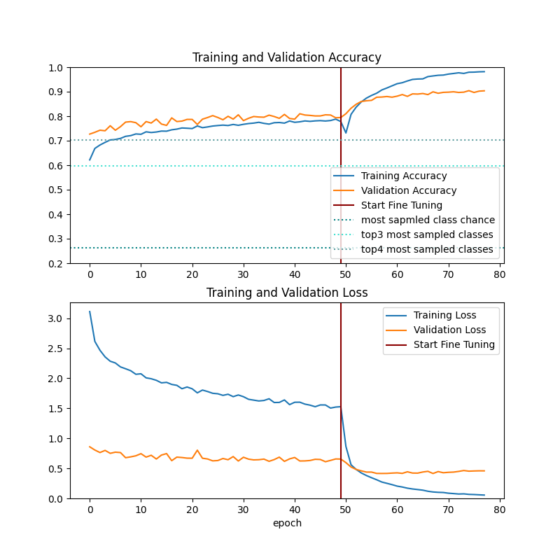
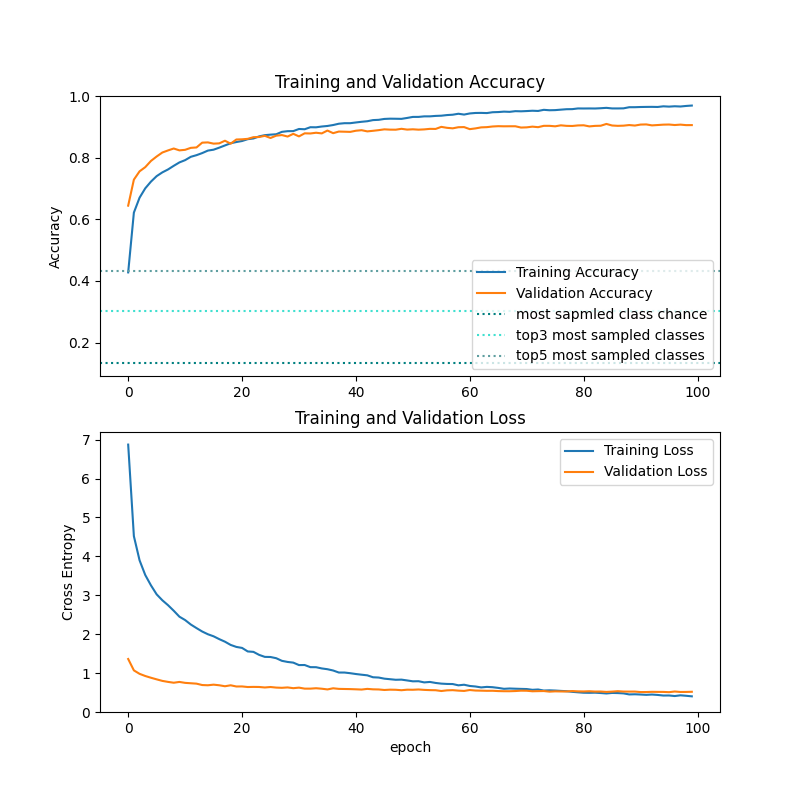
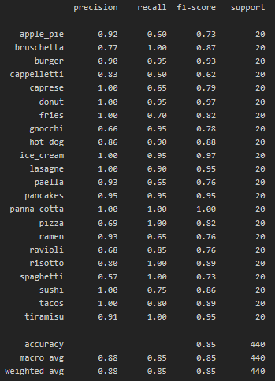

# multiClassDishRecognition
## Table of contents
* [Project description](#project-description)
* [Preparing the project](#Preparing-the-project)
* [Installing requirements](#Installing-requirements)
* [Dataset](#Dataset)
* [Results](#Results)

## Project description
This multiclass classification is just a part of a bigger project called Calera - the calorie-counting mobile application with functionality of predicting calories from picture.
### Machine learning segment
The machine learning segment of this project is divided into 2 parts: first model is a one class classifier which is used to predict whether there is food in the image (we don't want to give calorie prediction of cats and other uneatable things, it could cause some ethical issues). The second part is the dish classifier whose source code and results are available below.


## Preparing the project
You need:
* Python 3.7.9 or higher 
* Istall all requirements from requirements.txt


## Installing requirements
* With using Pip
```
pip install -r requirements.txt
```

* With using conda
```
conda install --file requirements.txt
```


## Dataset
The dataset has above 61 thousands of food images divided into 22 classes. Classes and sample photos are shown in the image below.
<kbd></kbd>

It has been divided into 3 subsets: training data, which has almost 43 thousands of images,
test data, which has 20% of all images, and the validation subset, which has the rest - 10% of all.


## Results
As of today, 45 iterations of model learning have been completed. The first graph shows the results of the training process of the twenty-ninth iteration, the model used then InceptionResNetV2 as the base model. This one achieved almost 90% accuracy on validation subset.

<kbd></kbd>
The second graph shows the latest training of the model, which was based, this time, on InceptionV3.
<kbd></kbd>
This model has 90% accuracy on validation subset and 85% accuracy on a specially selected data set - photos similar to those that could be taken by application users.
Per class precision, recall and f1 score is shown below.
<kbd></kbd>

