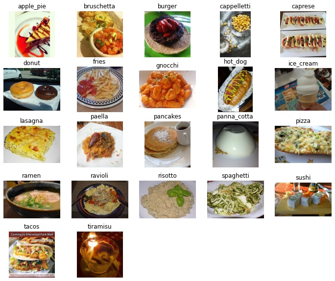

# multiClassDishRecognition
## Table of contents
* [Project description](#project-description)
* [Preparing the project](#Preparing-the-project)
* [Installing requirements](#Installing-requirements)
* [Dataset](#Dataset)
* [Results](#Results)

## Project description
This multiclass classification is just a part of a bigger project called Calera - Calorie Camera - the calorie-counting mobile application with functionality of predicting calories from picture.


## Preparing the project
You need:
* Python 3.7.9 or higher 
* Istall all requirements from requirements.txt


##Installing requirements
* With using Pip
```
pip install -r requirements.txt
```

* With using conda
```
conda install --file requirements.txt
```


##Dataset
The dataset has above 61 thousands of food images divided into 22 classes.
<kbd></kbd>

It has been divided into 3 subsets: training data, which has almost 43 thousands of images,
test data has 20% of all images, and the validation subset has the rest - 10% of all.


##Results

